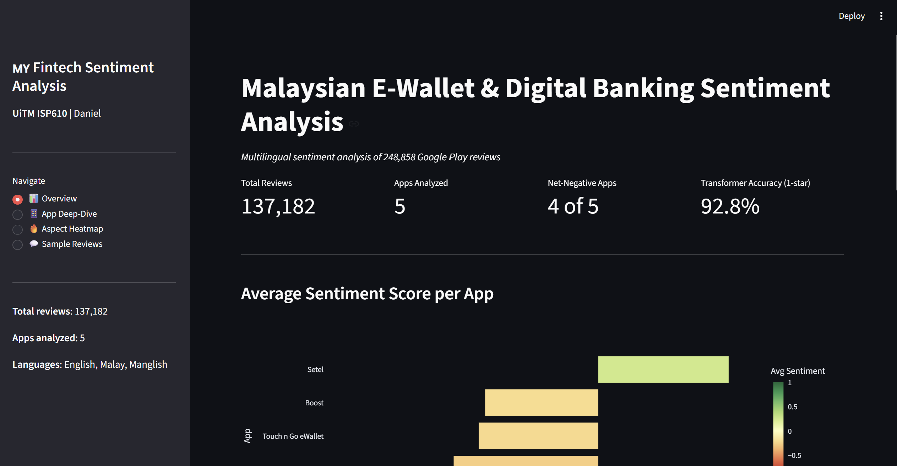
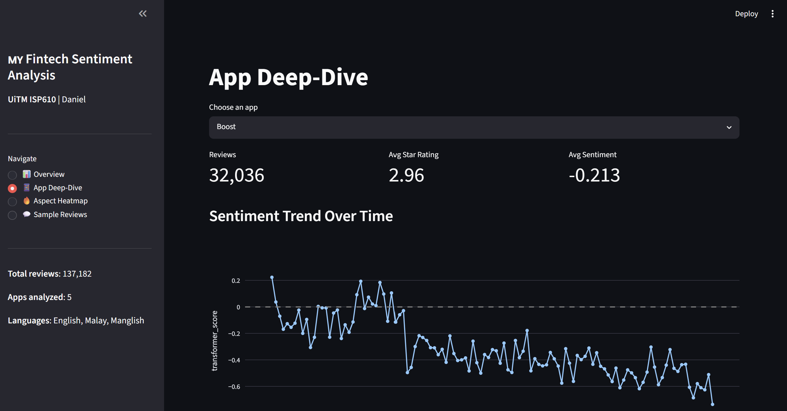
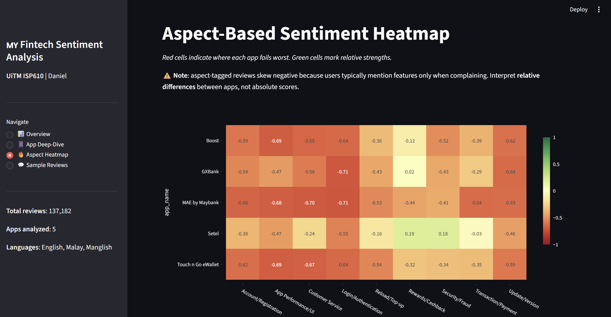
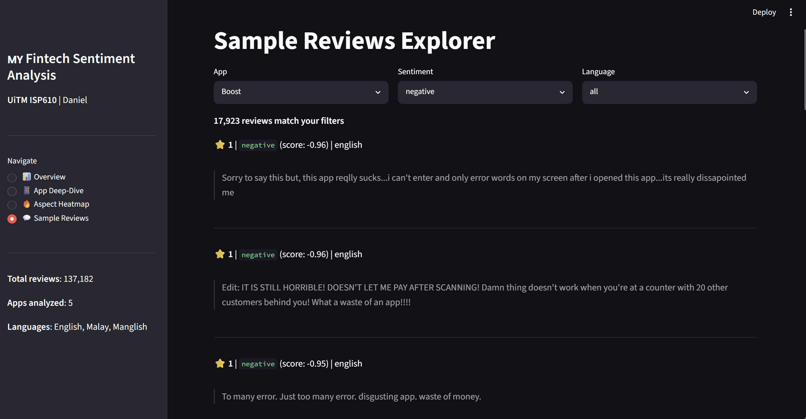
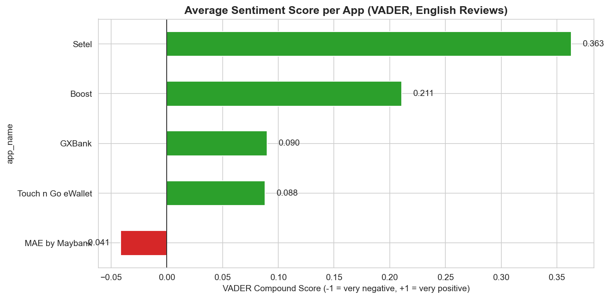

# Malaysian Fintech Sentiment Analysis 🇲🇾

[](https://malaysian-fintech-sentiment-analysis-qmpqjnmxenvy892i737mbd.streamlit.app/)
[](https://github.com/danieljasme-analyst/malaysian-fintech-sentiment-analysis)
[](LICENSE)

> Multilingual sentiment analysis of **248,858 Google Play reviews** across 5 leading Malaysian e-wallet and digital banking apps, comparing a rule-based VADER baseline against a multilingual transformer (XLM-RoBERTa) for production-grade sentiment classification on real-world bilingual data.

**Course**: ISP610 Business Data Analytics  
**Institution**: Universiti Teknologi MARA (UiTM)  
**Author**: Daniel — Final Year, Bachelor of Computer Science  
**Status**: ✅ Complete

---

## 🎯 Key Findings

- **4 out of 5** Malaysian fintech apps exhibit **net-negative user sentiment** once Malay-language reviews are included in the analysis
- The multilingual transformer correctly classifies **92.8%** of 1-star reviews as negative — compared to only **51.2%** for English-only VADER, a **+41 percentage-point gain**
- VADER systematically underestimated user dissatisfaction by **25–40 points** across all apps because it cannot read Malay or Manglish
- **MAE by Maybank** ranks worst in **5 out of 9** aspect categories, with Login/Authentication scoring −0.71 — driven specifically by Secure2U bugs, 24-hour password lockouts, and "rejecting correct passwords" complaints persisting from 2022 to 2025
- **TNG eWallet's** reload pain is **strategic, not technical** — users object to forced DuitNow migration, Go+ auto-sweep, and removed online banking reload
- **Setel** is the only app with positive aspect sentiment (+0.19 Rewards, +0.18 Security), succeeding by piggybacking on Petronas Mesra Points rather than inventing a parallel currency
- **BERTopic** discovered 4 complaint categories the hand-crafted aspect dictionary missed: intrusive notifications/ads, QR payment failures, unfulfilled cashback claims, and receipt generation failures

---

## 🧰 Tech Stack

| Layer | Tools |
|---|---|
| Data collection | `google-play-scraper`, pandas |
| Language handling | `langdetect`, custom bilingual keyword dictionaries |
| Baseline sentiment | VADER (rule-based, English only) |
| Production sentiment | Hugging Face `transformers`, XLM-RoBERTa (`cardiffnlp/twitter-xlm-roberta-base-sentiment`) |
| Topic modeling | BERTopic, `sentence-transformers` (multilingual MiniLM) |
| Visualization | matplotlib, seaborn, plotly |
| Dashboard | Streamlit, deployed on Streamlit Community Cloud |
| Compute | Python 3.14, Jupyter, Google Colab (T4 GPU for transformer inference) |
| Version control | Git, GitHub |

---

## 📊 Apps Analyzed

| App | Category | Reviews (clean) | Avg Transformer Sentiment |
|---|---|---:|---:|
| Touch 'n Go eWallet | E-wallet | 59,361 | −0.226 |
| Boost | E-wallet | 32,036 | −0.213 |
| MAE by Maybank | Digital banking | 25,947 | **−0.467** ⚠️ |
| Setel | Fuel payment | 17,294 | **+0.246** ✅ |
| GXBank | Digital bank | 2,544 | −0.273 |

---

## 🗺️ Project Pipeline

```
Phase 1 → Scrape 248,858 reviews (5 apps × English + Malay)
Phase 2 → Clean: dedupe (35% overlap removed), language-detect, filter → 137,182
Phase 3 → VADER baseline (English only) → 51.2% accuracy on 1-star
Phase 4 → XLM-RoBERTa multilingual transformer → 92.8% accuracy on 1-star
Phase 5 → Aspect-Based Sentiment Analysis across 9 categories
Phase 6 → BERTopic auto-discovery of 15 complaint topics
Phase 7 → Interactive Streamlit dashboard + deployment
```

---

## 📁 Repository Structure

```
malaysian-fintech-sentiment-analysis/
├── README.md
├── LICENSE
├── requirements.txt
├── .gitignore
├── app.py                          ← Streamlit dashboard
│
├── notebooks/
│   ├── 01_data_exploration.ipynb       ← Phases 1–3, 5, 6
│   └── 02_transformer_sentiment.ipynb  ← Phase 4 (Colab GPU)
│
├── scripts/
│   ├── scrape_reviews.py               ← Initial Play Store scraper
│   └── scrape_missing.py               ← Top-up scraper for missing apps
│
├── data/
│   ├── dashboard_data.csv              ← Slim 30k stratified sample
│   ├── aspect_sentiment_pivot.csv      ← Aspect × app sentiment matrix
│   └── phase6_topic_info.csv           ← BERTopic topic descriptions
│
├── figures/
│   ├── phase3_vader_by_app.png
│   ├── phase3_vader_distribution.png
│   ├── phase5_aspect_heatmap.png       ← Main visual
│   └── screenshots/
│       ├── screenshot_01_overview.png
│       ├── screenshot_02_deepdive.png
│       ├── screenshot_03_heatmap.png
│       └── screenshot_04_reviews.png
│
└── visualizations/
    ├── phase6_topics_barchart.html        ← Interactive (open in browser)
    ├── phase6_topics_barchart_clean.html
    └── phase6_topics_map.html
```

> 📝 **Note**: raw and intermediate CSV files (`reviews_raw_*.csv`, `reviews_cleaned.csv`, `reviews_master.csv`) are excluded from the repo via `.gitignore` due to size. They can be regenerated by running `scripts/scrape_reviews.py` followed by the notebook.

---

## 🖼️ Dashboard Preview

### Overview Page


### App Deep-Dive (MAE by Maybank)


### Aspect Heatmap — Where Each App Fails


### Sample Reviews Explorer


> 🚀 **[Try the live dashboard →](https://malaysian-fintech-sentiment-analysis-qmpqjnmxenvy892i737mbd.streamlit.app/)**

---

## 🔬 Methodology Highlights

### Multilingual handling
Malaysian fintech users write in **English (57%)**, **Malay (34%)**, and **Manglish (9%)** — code-switching that resists standard NLP tooling. The project benchmarks an English-only baseline against a multilingual model to demonstrate the cost of language-monoculture in Southeast Asian text analytics.

### Aspect dictionary (9 categories)
Login/Authentication · Reload/Top-up · Transaction/Payment · Customer Service · App Performance/UI · Rewards/Cashback · Update/Version · Security/Fraud · Account/Registration

Each aspect uses **bilingual keywords** (e.g. Login matches `login`, `secure2u`, `kata laluan`, `tak boleh login`).

### Documented limitations
- **Selection bias in aspect-tagged reviews**: users typically mention specific features only when problems occur, so aspect-level scores skew negative across the board. Interpretation focuses on **relative differences between apps**, not absolute scores.
- **Language detection ambiguity**: `langdetect` cannot reliably separate Malay (ms) from Indonesian (id); both are treated as Malay.
- **Manglish misclassification**: ~9% of reviews use mixed English-Malay patterns that get classified as Afrikaans, Tagalog, or Welsh by the language detector. Treated as a separate category to avoid systematic bias.
- **Rating ≠ sentiment**: a non-trivial share of 5-star reviews contain negative content (users sometimes inflate ratings hoping for visibility on complaints). Star ratings alone are unreliable for measuring satisfaction in Malaysian fintech.

---

## 📈 Selected Visuals

### Aspect × App Sentiment Heatmap
The project's main visual: red cells mark where each app fails worst, green cells mark relative strengths.


### VADER Baseline
Initial English-only baseline showed only MAE as net-negative — later disproven once Malay reviews were included.




---

## 🚀 Reproducing the Analysis

```bash
# 1. Clone and set up environment
git clone https://github.com/danieljasme-analyst/malaysian-fintech-sentiment-analysis.git
cd malaysian-fintech-sentiment-analysis
python -m venv venv

# Activate venv
# Windows:  venv\Scripts\activate
# Mac/Linux: source venv/bin/activate

# 2. Install dependencies
pip install -r requirements.txt

# For full pipeline (notebooks), also install:
pip install google-play-scraper langdetect vaderSentiment tqdm bertopic sentence-transformers transformers torch

# 3. Scrape reviews (~30 minutes)
python scripts/scrape_reviews.py
python scripts/scrape_missing.py

# 4. Run Phases 2–3, 5, 6 in Jupyter
jupyter notebook notebooks/01_data_exploration.ipynb

# 5. Run Phase 4 in Google Colab (free T4 GPU recommended)
# Upload notebooks/02_transformer_sentiment.ipynb to https://colab.research.google.com
# Runtime → Change runtime type → T4 GPU

# 6. Launch the dashboard locally
streamlit run app.py
```

---

## 📚 References & Models Used

- [`cardiffnlp/twitter-xlm-roberta-base-sentiment`](https://huggingface.co/cardiffnlp/twitter-xlm-roberta-base-sentiment) — multilingual XLM-RoBERTa fine-tuned for sentiment
- [`paraphrase-multilingual-MiniLM-L12-v2`](https://huggingface.co/sentence-transformers/paraphrase-multilingual-MiniLM-L12-v2) — embedding model for BERTopic
- [VADER Sentiment](https://github.com/cjhutto/vaderSentiment) — rule-based baseline
- [google-play-scraper](https://pypi.org/project/google-play-scraper/) — data collection
- [BERTopic](https://maartengr.github.io/BERTopic/) — topic modeling
- [Streamlit](https://streamlit.io/) — interactive dashboard

---

## 📜 Disclaimer & License

This is **academic coursework** undertaken as part of UiTM ISP610. Review data scraped from Google Play Store belongs to the original reviewers and Google. Findings represent **aggregate user sentiment patterns** at the time of scraping (June 2026) and should not be interpreted as definitive judgments on any company's products or service quality. No affiliation with any of the apps or companies analyzed.

Code released under MIT License. See [`LICENSE`](LICENSE).

---

## 📬 Contact

Open to internship opportunities in **data analytics, NLP, and fintech**.

- LinkedIn: [www.linkedin.com/in/ahmad-daniel-63721b322]
- Email: [danieljasme5@gmail.com]
- University: Universiti Teknologi MARA (UiTM)